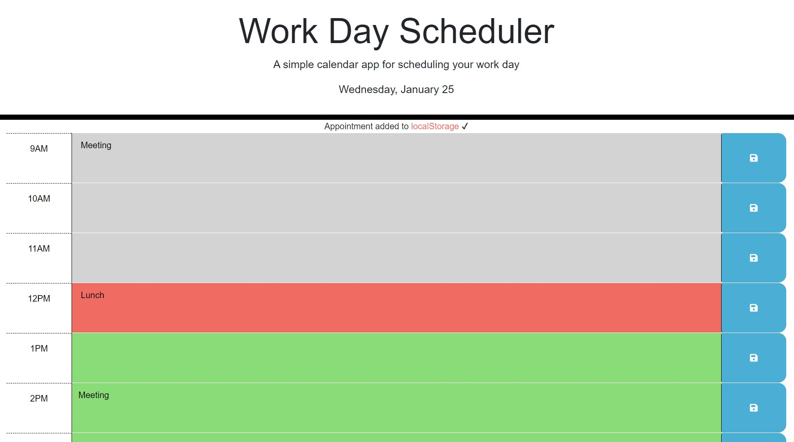

# work-day-scheduler

## Description

The aim of this project was to create a simple work day scheduler (9AM to 5PM) that will allow users to add and save events for each hour. In addition, the user can see whether each event already happened, in the process, or will happen in the future, based on the current time.
Working on this project, I gained further understanding of JQuery and its ability to dinamically update HTML and CSS codes. I also learned how to use the Day.js library to access date. Finally, this project provided me with additional practice on saving information into the local storage of a browser.

## Installation

n/a

## Usage

When the user opens the application, they will see today's date at the top of the page. The user then can add events for any of the work hours and save them. When the user refreshes the page, the event will stay saved in the initial time block. Based on the current hour, each time block will indicate whether it belongs to the past, present, or future through different background colours: grey, red, and green, respectively.  

## Credits

Luba Mintsys. https://github.com/lmintsys

## License

MIT License

Copyright (c) 2023 lmintsys

Permission is hereby granted, free of charge, to any person obtaining a copy
of this software and associated documentation files (the "Software"), to deal
in the Software without restriction, including without limitation the rights
to use, copy, modify, merge, publish, distribute, sublicense, and/or sell
copies of the Software, and to permit persons to whom the Software is
furnished to do so, subject to the following conditions:

The above copyright notice and this permission notice shall be included in all
copies or substantial portions of the Software.

THE SOFTWARE IS PROVIDED "AS IS", WITHOUT WARRANTY OF ANY KIND, EXPRESS OR
IMPLIED, INCLUDING BUT NOT LIMITED TO THE WARRANTIES OF MERCHANTABILITY,
FITNESS FOR A PARTICULAR PURPOSE AND NONINFRINGEMENT. IN NO EVENT SHALL THE
AUTHORS OR COPYRIGHT HOLDERS BE LIABLE FOR ANY CLAIM, DAMAGES OR OTHER
LIABILITY, WHETHER IN AN ACTION OF CONTRACT, TORT OR OTHERWISE, ARISING FROM,
OUT OF OR IN CONNECTION WITH THE SOFTWARE OR THE USE OR OTHER DEALINGS IN THE
SOFTWARE.
